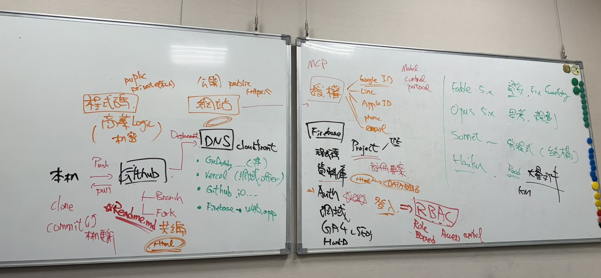

# 資安證照課程雷達

ISO 27001／27701／27017・27018／42001 與個資管理的**稽核員培訓開課清單**，四個人共同維護。

每天打開看一眼，別讓早鳥價和報名截止日溜掉。

**線上版：** https://robinaudi.github.io/iso-cert-radar/ （要用 Google 帳號登入，受邀成員才進得去；沒被授權的帳號可以在頁面上按「申請存取」）

---

## 這個清單想解決什麼

開課資訊散在十幾個主辦單位的官網，沒有人整理。更麻煩的是，**很多課名都叫「內部稽核員」，但發的證書等級完全不同** — 有的是 IRCA 國際登錄，有的只是結業證書，拿去應付驗證是無效的。

所以這份清單除了彙整梯次，還做了兩層分類：

- 🏅 **國際登錄證照** — CQI & IRCA 登錄，可註冊為第三方稽核員
- 📜 **ISO 稽核員證書** — 可作為驗證時的內稽訓練佐證
- 📘 **補知識・不發證照** — 結業證書，不構成稽核員資格

加上 🏢 **平日（要請假）** 與 🌅 **假日（不影響上班）** 的標示。

---

## 我想…

| | |
| --- | --- |
| **看課程** | 直接開 [線上版](https://robinaudi.github.io/iso-cert-radar/) |
| **改資料 / 補一梯新的** | 讀 [CONTRIBUTING.md](CONTRIBUTING.md) |
| **回報但不想自己改** | 開一個 [Issue](../../issues/new/choose) |

---

## 這個 repo 長什麼樣

```
iso-cert-radar/
├── index.html              網頁本身（版面與邏輯）
├── data/courses.json       ⭐ 課程資料 — 平常只會動到這個檔
├── scripts/validate.mjs    資料檢查器，CI 會跑
└── .github/workflows/
    ├── validate.yml        CI：每個 PR 自動檢查資料格式
    └── deploy.yml          CD：合併進 main 就自動上線
```

**內容與程式是分開的。** 要改課程資訊，動 `data/courses.json` 就好，不需要碰 HTML。

---

## 本機跑起來

不需要安裝任何套件。

```bash
npm start                    # 或 python3 -m http.server 8000
node scripts/validate.mjs    # 推上去之前先自己檢查一次
```

> ⚠️ 不要用滑鼠雙擊 `index.html`，瀏覽器會擋掉本機讀取 JSON，畫面會是空的。

---

## 資料來源

各主辦單位官網／報名頁：[領導力 ISO 管理學院](https://isokm.com.tw/event/category/68)、[全智網](https://ainetwork-training.com/courses/)、[中國生產力中心](https://edu.cpc.org.tw/class/content/303)、[電腦稽核協會](https://www.caa.org.tw/coursedetail-37002.html)、[亞瑞仕](https://www.ares-registration.com/)、[TPIPAS](https://www.tpipas.org.tw/course_list.aspx?no=118)、[臺北市中小企業知識學苑](https://www.startup.taipei/index.php?action=course&cid=83)、[勞動部產業人才投資方案](https://ojt.wda.gov.tw/ClassSearch)。

價格一律標早鳥／優惠價，**報名前請務必到來源頁再確認一次** — 早鳥條件（開課前 10 天、一個月前、三人同行）各家不同。

---

## 2026-09-11 教育訓練白板筆記

> 整理自當天的白板照片，不是逐字會議紀錄。白板上的筆誤已在文末更正。



### 左板：程式碼怎麼從自己電腦變成網站

**程式碼放哪裡**
- repo 可以是 **public（公開）** 或 **private（私人）**。
- 商業邏輯屬於機密，放 private；這個課程雷達的內容本來就是公開資訊，所以 repo 是 public。

**本機 ⇄ GitHub**

| 動作 | 白話 |
| --- | --- |
| `clone` | 第一次把 repo 整包抓到自己電腦 |
| `commit` | 在本機存一個版本（還沒上傳） |
| `push` | 把本機的 commit 推上 GitHub |
| `pull` | 把別人推上去的改動拉回自己電腦 |

**四個人怎麼共編**
- `Branch`：在同一個 repo 裡開分支改，改完開 PR 合併。
- `Fork`：把 repo 複製一份到自己帳號改，改完一樣開 PR 回來。
- 共編的起點就是這份 README.md，詳細流程看 [CONTRIBUTING.md](CONTRIBUTING.md)。

**網站怎麼上線（Deployment）**
- 網站是公開的，網址用 `https://` 開頭。
- GitHub 合併進 main 之後會自動部署，這個專案就是這樣運作。
- 放網站的地方：

| 服務 | 特色 |
| --- | --- |
| GoDaddy | 買自己的網域（要付費） |
| Vercel | 免費附一個 `.vercel.app` 網址 |
| GitHub Pages | 免費的 `github.io` 網址，**這個專案用的就是它** |
| Firebase Hosting | 免費的 `web.app` 網址 |

- **DNS** 負責把網域名稱指到放網站的主機。

### 右板：登入與權限

**授權（用什麼登入）**：Google 帳號、LINE、Apple ID、手機號碼、Email。

**Firebase 一個專案（Project）裡有什麼**
- 程式碼（Hosting）、資料庫（Firestore）、Auth（登入）、網域。
- 網頁（HTML）登入之後，才去讀寫資料庫。

**登入 ≠ 權限：RBAC**
- 登入只證明「你是誰」；**RBAC（Role-Based Access Control，角色權限控管）** 決定「你能做什麼」。
- 這個網站就是例子：管理員可以開通成員，成員看得到課程，其他人只看到 hello 頁。

**GA4**：Google Analytics 4，看網站有多少人來、從哪裡來。

**MCP（Model Context Protocol）**：讓 AI 連到外部工具和資料的共通標準。

### 右板：Claude 模型怎麼分工

| 模型 | 適合做什麼 |
| --- | --- |
| Fable 5.x | 審查、找出問題並修好（Fix everything） |
| Opus 5.x | 思考、規劃 |
| Sonnet | 寫程式（架構） |
| Haiku | 快速讀大量文件、整理成知識庫（KM） |

### 白板筆誤更正

| 白板上寫的 | 正確 |
| --- | --- |
| puplic | public |
| MCP = Model **Control** Protocol | MCP = Model **Context** Protocol |
| DNS 旁邊寫 CloudFront | CloudFront 是 AWS 的 **CDN**（內容快取加速），不是 DNS；AWS 的 DNS 服務叫 Route 53 |
| GA4（SEO） | GA4 是**流量分析**；SEO 是**搜尋排名優化**，兩件事相關但不同 |
